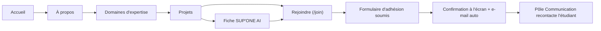
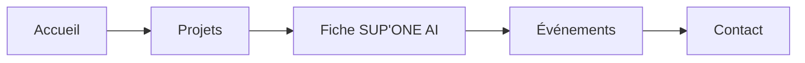
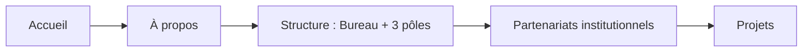
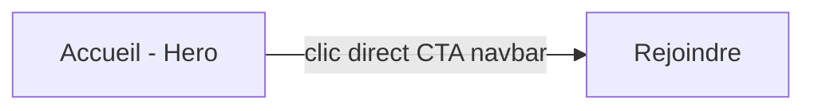
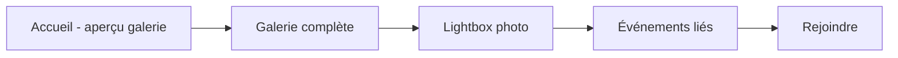

# Appflow — Parcours utilisateurs
## Site officiel du Club Informatique SUP'PTIC

---

## 1. Parcours « Étudiant candidat » (parcours principal)

| Étape | Page / action | Objectif |
|---|---|---|
| 1 | Accueil | Découvrir le Club et sa personnalité en quelques secondes |
| 2 | À propos | Comprendre la mission, les valeurs et la structure en pôles |
| 3 | Domaines d'expertise (accueil ou about) | Identifier le domaine technique qui l'intéresse |
| 4 | Projets → SUP'ONE AI | Voir une réalisation concrète et crédible, se projeter |
| 5 | Rejoindre | Remplir le formulaire d'adhésion avec le pôle/domaine d'intérêt |
| 6 | Confirmation | Recevoir une confirmation immédiate + e-mail automatique |
| 7 | Suivi (hors site) | Le Pôle Communication traite la candidature |

## 2. Parcours « Entreprise / partenaire potentiel »

Ce parcours privilégie la preuve par les réalisations : SUP'ONE AI et les événements (hackathons, conférences) démontrent la capacité technique du Club avant tout contact commercial.

## 3. Parcours « Administration SUP'PTIC / enseignant »

Ce parcours privilégie la crédibilité institutionnelle et la conformité à la Charte officielle du Club.

## 4. Parcours « Visiteur mobile pressé »

Le bouton "Rejoindre" doit rester accessible en un clic depuis n'importe quelle page via la navbar, quel que soit le point d'entrée.

## 5. Parcours « Découverte de la vie du club »

## 6. Points de friction à éviter

- Formulaire d'adhésion trop long → se limiter aux champs strictement utiles (voir Backend Schema).
- Absence de confirmation claire après soumission → toujours afficher un état de succès explicite à l'écran, en plus de l'e-mail.
- Fiche SUP'ONE AI noyée parmi les autres projets → mise en avant visuelle systématique (badge "Projet phare", position n°1).
- Galerie lente à charger sur mobile → chargement différé (lazy loading) des images hors écran.
- Contenu "À propos" trop proche d'un copier-coller de la Charte → reformuler dans un ton accessible tout en restant fidèle au fond.
