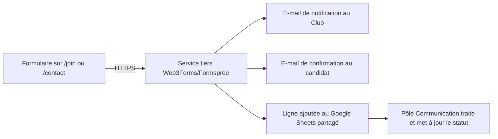

# Backend Schema

## Site officiel du Club Informatique SUP'PTIC

Le site étant statique (pas de CMS, pas de base de données applicative), ce schéma décrit deux types de données :

1. **Contenu éditorial** (projets, événements, galerie, équipe) → géré en fichiers JSON/Markdown versionnés dans le repo Git.
2. **Données de formulaires** (adhésion, contact) → acheminées via un service tiers gratuit vers e-mail + Google Sheets.

---

## 1. Contenu éditorial (fichiers versionnés)

### 1.1 `content/fr/projects.json` — Projets

| Champ                | Type               | Obligatoire | Notes                                                                    |
| -------------------- | ------------------ | ----------- | ------------------------------------------------------------------------ |
| `id`                 | string (slug)      | Oui         | Ex. `"supone-ai"` — utilisé dans l'URL `/projects/supone-ai`             |
| `nom`                | string             | Oui         |                                                                          |
| `description_courte` | string             | Oui         | Affichée sur les cartes                                                  |
| `description_longue` | string (markdown)  | Oui         | Affichée sur la fiche détaillée                                          |
| `statut`             | enum               | Oui         | `"Terminé"` / `"En cours"`                                               |
| `domaines`           | array de string    | Oui         | Référence aux domaines d'expertise (ex. `["Intelligence Artificielle"]`) |
| `technologies`       | array de string    | Oui         | Tags affichés en badges                                                  |
| `image_principale`   | string (chemin)    | Oui         |                                                                          |
| `images_secondaires` | array de string    | Non         | Pour le carrousel de la fiche détaillée                                  |
| `video_url`          | string (URL embed) | Non         | YouTube/Vimeo                                                            |
| `lien_github`        | string (URL)       | Non         |                                                                          |
| `lien_demo`          | string (URL)       | Non         |                                                                          |
| `est_projet_phare`   | boolean            | Oui         | `true` pour SUP'ONE AI en V1                                             |
| `equipe_porteuse`    | string             | Non         | Ex. `"Pôle Innovation & Projets"`                                        |

### 1.2 `content/fr/expertise.json` — Domaines d'expertise

| Champ         | Type                 | Obligatoire                           |
| ------------- | -------------------- | ------------------------------------- |
| `id`          | string (slug)        | Oui                                   |
| `nom`         | string               | Oui — ex. "Intelligence Artificielle" |
| `description` | string               | Oui                                   |
| `icone`       | string (nom d'icône) | Oui                                   |

### 1.3 `content/fr/events.json` — Activités & événements

| Champ          | Type                             | Obligatoire | Notes                                                                              |
| -------------- | -------------------------------- | ----------- | ---------------------------------------------------------------------------------- |
| `id`           | string                           | Oui         |                                                                                    |
| `titre`        | string                           | Oui         |                                                                                    |
| `type`         | enum                             | Oui         | `Formation / Conférence / Hackathon / Atelier / Concours / Visite / Collaboration` |
| `date`         | date                             | Oui         |                                                                                    |
| `description`  | string                           | Oui         |                                                                                    |
| `image`        | string (chemin)                  | Non         |                                                                                    |
| `lien_galerie` | string (id de catégorie galerie) | Non         | Pour lier l'événement à ses photos                                                 |

### 1.4 `content/fr/gallery.json` — Galerie

| Champ           | Type                  | Obligatoire                                             |
| --------------- | --------------------- | ------------------------------------------------------- |
| `id`            | string                | Oui                                                     |
| `image`         | string (chemin)       | Oui                                                     |
| `legende`       | string                | Non                                                     |
| `categorie`     | enum                  | Oui — `Événements / Formations / Projets / Vie du club` |
| `evenement_lie` | string (id événement) | Non                                                     |

### 1.5 `content/fr/team.json` — Bureau Exécutif & pôles

| Champ   | Type            | Obligatoire                                         |
| ------- | --------------- | --------------------------------------------------- |
| `nom`   | string          | Oui                                                 |
| `role`  | string          | Oui — ex. "Président", "Chef du Pôle Développement" |
| `pole`  | enum            | Non                                                 | `Bureau Exécutif / Innovation & Projets / Développement / Communication` |
| `photo` | string (chemin) | Non                                                 |

---

## 2. Données de formulaires (services tiers, sans base de données)

### 2.1 Formulaire d'adhésion — modèle « Candidature »

| Champ               | Type                             | Obligatoire | Notes                                                |
| ------------------- | -------------------------------- | ----------- | ---------------------------------------------------- |
| `id_soumission`     | auto                             | Oui         | Généré par le service de formulaire                  |
| `nom_complet`       | texte                            | Oui         |                                                      |
| `matricule`         | texte                            | Oui         | Vérifie l'appartenance à SUP'PTIC                    |
| `filiere`           | liste déroulante                 | Oui         |                                                      |
| `annee_etude`       | liste déroulante                 | Oui         | ITT1 / ITT2 / ITT3 / Master / Autre                  |
| `email`             | email                            | Oui         | Pour l'accusé de réception                           |
| `telephone`         | texte                            | Non         |                                                      |
| `domaine_interet`   | choix multiple                   | Oui         | Référencé depuis `expertise.json`                    |
| `pole_interet`      | choix unique                     | Oui         | Innovation & Projets / Développement / Communication |
| `motivation`        | texte long                       | Oui         | Limité (~500 caractères)                             |
| `date_soumission`   | date/heure (auto)                | Oui         |                                                      |
| `statut_traitement` | choix unique (géré manuellement) | —           | Nouveau / Contacté / Accepté / Refusé                |

### 2.2 Formulaire de contact — modèle « Message »

| Champ             | Type              | Obligatoire |
| ----------------- | ----------------- | ----------- |
| `nom`             | texte             | Oui         |
| `email`           | email             | Oui         |
| `sujet`           | texte             | Oui         |
| `message`         | texte long        | Oui         |
| `date_soumission` | date/heure (auto) | Oui         |

### 2.3 Flux de données

### 2.4 Stockage de suivi recommandé

Un Google Sheets partagé avec deux onglets :

- **Candidatures** (champs de la section 2.1)
- **Messages** (champs de la section 2.2)

Ce Sheets sert de tableau de bord de suivi en attendant une éventuelle V2 avec base de données réelle et back-office.
